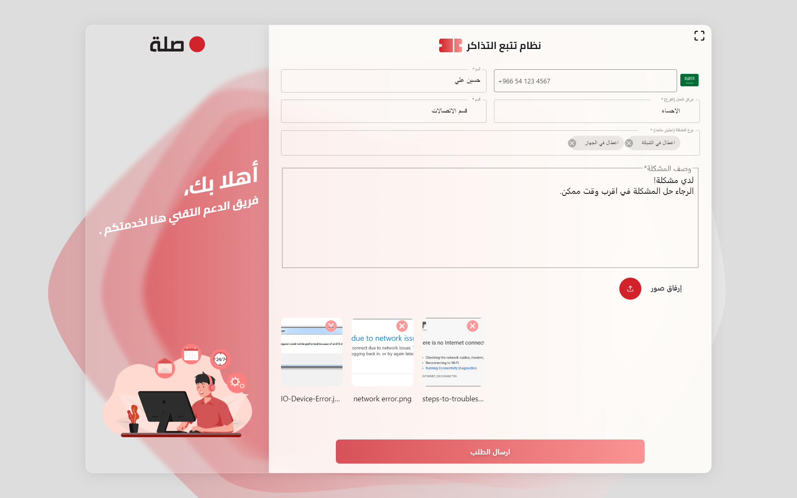
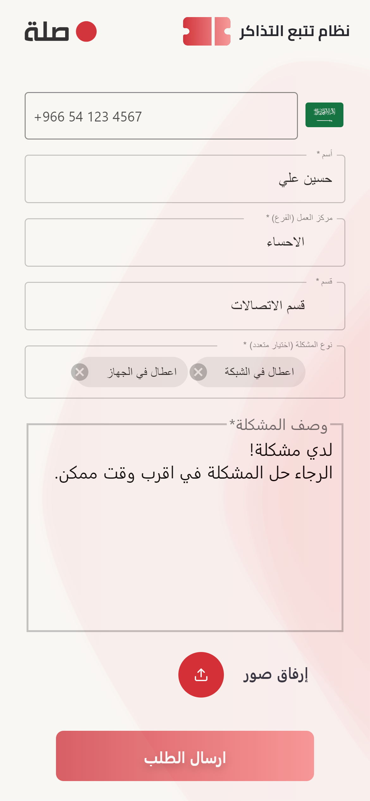
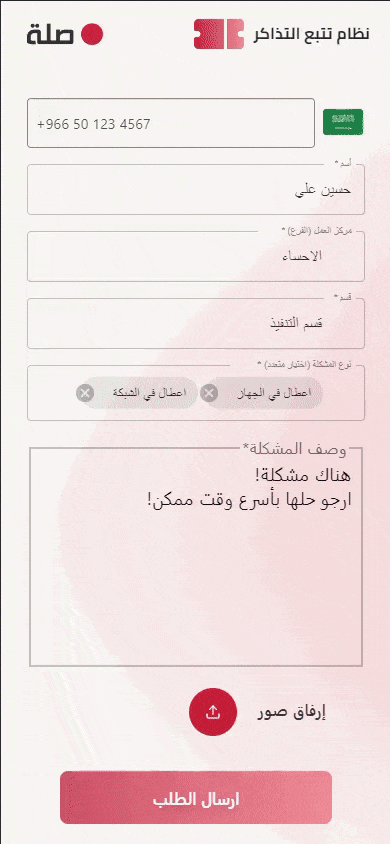

<!-- PROJECT LOGO -->

 

  
   
    <h6 align="center">Sorry :( Not Finished Yet</h6>

 

 <!-- TABLE OF CONTENTS -->

  
Table of Contents

  <ol>
    <li>
      <a href="#about">About The Project</a>
        <ul>
            <li><a href="#tools">Built With</a></li>
         </ul>
    </li>
    <li>
      <a href="#overall_outcomes">Overall Outcomes/Achievements</a>
      <ul>
        <li><a href="#form">Form Page</a></li>
        <li><a href="#admin-login">Login Page</a></li>
        <li><a href="#agents">Agents Page</a></li>
        <ul>
            <li><a href="#create-new-agent">Create New Agent</a></li>
          </ul>
        <li><a href="#Tickets">Tickets Page</a></li>
        <li><a href="#Ticket-Details">Ticket Details Page</a></li>
        <li><a href="#dashboard">Admin Dashboard Page</a></li>
        <ul>
            <li><a href="#between-interval">Select Between Interval</a></li>
            <li><a href="#export">Export</a></li>
         </ul>
        <li><a href="#setting">Setting Page</a></li>
        <ul>
            <li><a href="#theme-setting">Theme's Setting</a></li>
            <li><a href="#account-setting">Account Settings</a></li>
         </ul>
      </ul>
    </li>
  </ol>

 

<!-- ABOUT THE PROJECT -->
<a name="about"/>

## About The Project

The Tickets Tracking System is a customer service application that enables customers to create tickets detailing their issues, and agents can contact customers for follow-up. The dashboard page displays a summary of the tickets and general details. Moreover, the ticket details page includes images and detailed descriptions of the customers' issues. The application also features an agents page to manage and assign roles, such as admin, super admin, and agent. The project aims to streamline customer service for businesses and enhance customer satisfaction.

<a name="tools"/>

### Built With

* [React](https://ar.reactjs.org)
* [Material-UI](https://material-ui.com)
* [Laravel](https://laravel.com/)

<a name="overall_outcomes"/>  

## Overall Outcomes/Achievements

<a name="form"/>  
  
### Form Page:

- The Form page is a user-friendly and responsive interface that allows customers to publish a new tickets detailing their issues. It includes fields for essential information, such as name, email, phone number, description and images of the issue.

  
  

  

- Once a customer submits a ticket, it will be forwarded to the agents in the admin dashboard, allowing them to view the issue and reach out to the customer for resolution.

  

